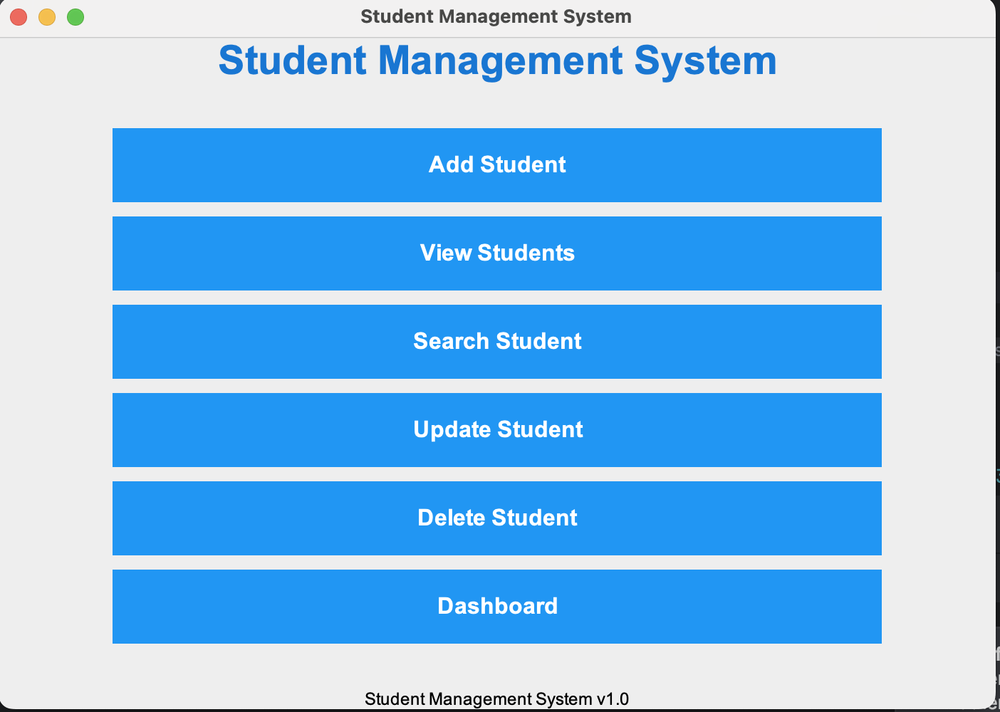
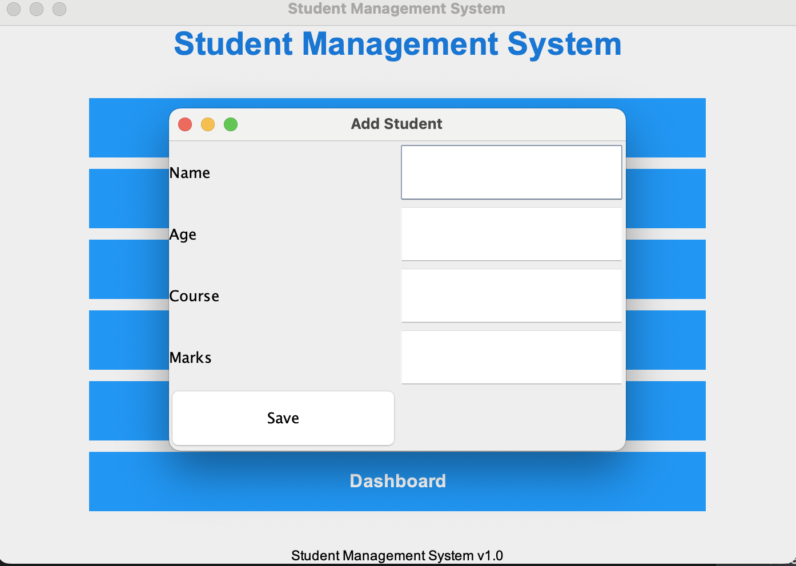
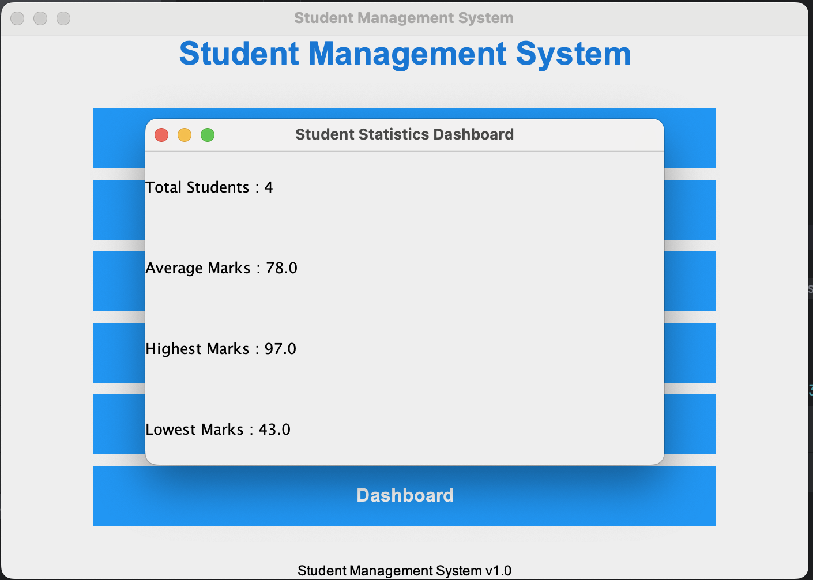

# Student Management System
## Project Description

Student Management System is a desktop application developed using Java Swing, JDBC, and MySQL.

The application allows users to manage student records by adding, viewing, searching, updating, and deleting student information through a graphical user interface.

## Features

- Add Student
- View All Students
- Search Student
- Update Student
- Delete Student
- Dashboard
- MySQL Database Integration
- Java Swing GUI
- Input Validation
- Stored Procedure Support

- ## Technologies Used

- Java
- Java Swing
- JDBC
- MySQL
- Maven
- IntelliJ IDEA
- Git
- GitHub

- ## Project Structure

```
StudentManagementSystem
│
├── src
│   ├── main
│   │   ├── java
│   │   │   ├── app
│   │   │   ├── dao
│   │   │   ├── gui
│   │   │   ├── model
│   │   │   └── util
│
├── pom.xml
├── README.md
└── .gitignore
```

## Installation

1. Clone the repository

```bash
git clone https://github.com/AhtishamAhmad619/Student-Management-System.git
```

2. Open the project in IntelliJ IDEA.

3. Install MySQL.

4. Create the database.

5. Update the database username and password in `DBConnection.java`.

6. Run `Main.java`.

7. ## Database Setup

Create a database named:

```sql
studentdb
```

Create the `students` table.

Import the SQL script if available.

Update database credentials inside:

```text
DBConnection.java
```

## Screenshots

### Main Window



### Add Student



### Dashboard




## Author

**Ahtisham Ahmad**

Java Developer

GitHub:
https://github.com/AhtishamAhmad619
